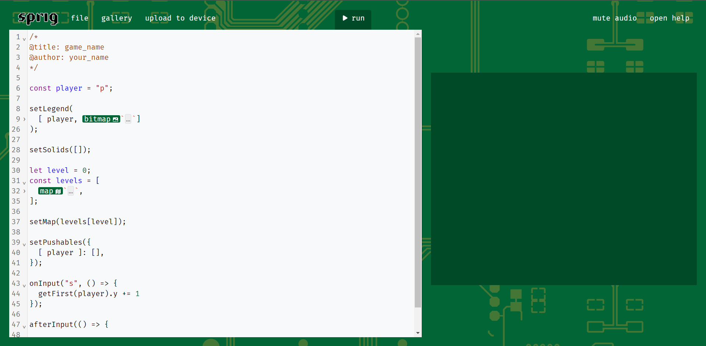
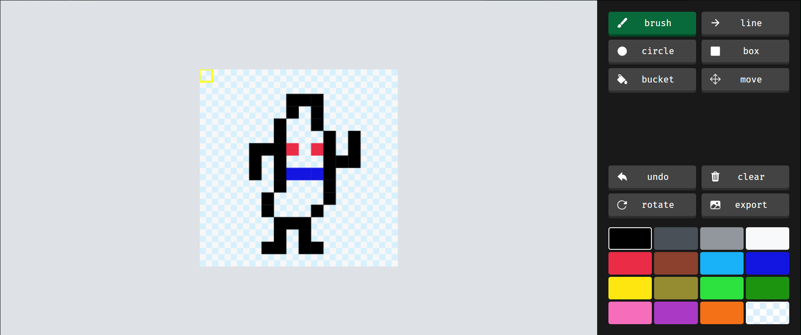
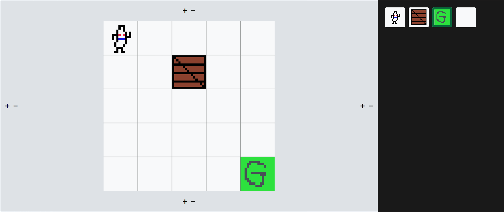

# Sprig Workshop - Beginner Level

## What is Sprig?
Sprig is a open-source handheld console developed by Hack Club. It uses a Raspberry Pi Pico and you can write games for it using Javascript. It is a tiny game engine that is embedded into the web and allows for you to quickly create tile-based games. Once you are done building your game, you can share it by making a PR, which if approved, will add it to the gallery.

## Getting Started
Go to the [Sprig editor](https://editor.sprig.hackclub.com/) to start creating your own Sprig games. In this workshop we will build a simple game where you will control a player that pushes boxes into a goal.

### Creating and saving a game
When you open up sprig editor, you should be greeted by some code that is already there to serve as a little tutorial. In this workshop we won't need that code, so you can delete everything to get a clean file.

To save the game, you first need to name it by adding a multiline comment like this:
```
/*
  @title: your_game
  @author: your_name
*/
```
Next, you can save the game by going to `file` -> `save`, or by pressing ctrl + s. The game will be saved in the local storage in your browser, and it will not be accessible outside of your browser. To save it reliabily, download it as a `.js` file by going to `file` -> `share` -> `as file`.

### Sprite and bitmaps
All the interactable characters in your game will have to be sprites. To declare some sprites follow these steps:  
First, declare the characters you will be using to identify your sprites.
```
const player = "p";
const box = "b";
const goal = "g";
```
Next, you will need to give them some textures.
```
setLegend(
  [ player, bitmap`` ],
  [ box, bitmap`` ],
  [ goal, bitmap`` ]
);
```
Typing out the `bitmap` keyword should make it green and clickable. Clicking on it will open up the sprite editor, where you will be able to draw out what you want your sprites to look like.


### Levels and maps
Now that you have the sprites, next thing you will need is a level for the sprites to move and play around in. Creating a level is very similar to creating a bitmap for a sprite.
```
let level = 0;
const levels =  [
  map``
];
let currentLevel = levels[level];
```
Like the `bitmap` keyword, the `map` is also clickable, and clicking it will open the map editor, where you can edit how you want your level to look like. You change the size the level, as well as adding sprites to the tiles.

Once you are satisfied with your level, you can set that level as the one to be used.
```
setMap(currentLevel);
```

### Pushing Solids
Now we must add the mechanic of the player being able to push boxes. To first do this, we must set both the player and the box sprites as solids. Anything that is set as a solid cannot overlap with anything else that is solid.
```
setSolids([ player, box ]);
```
Next, we must make it so that the box sprite can be pushed around by the player sprite. This can be done by the `setPushables` function, which determines which sprites are allowed to push which sprites.
```
setPushables({
  [ player ]: [ box ]
});
```
Now we are able to push around the box, but we can't do that yet as we can't move around!

### Taking Inputs
The Sprig console has 8 push buttons that it can take input from, which we can in the browser version represent as `WASD` and `IJKL`. To react to any presses of these keys, we can use the `onInput` function. Inside it, we can specify what we want to happen when that key is pressed. For our game, we want to move the player around using `WASD` keys. To move the player around, we can change the x and y components of the player sprite.
```
onInput("s", () => {
  let playerSprite = getFirst(player);  // Gets the sprite of the player
  playerSprite.y++;                     // Moves the player one tile down
});
```
Try to replicate it for the W, A, and D keys to make the player move around in all four directions.

### Winning the game
Now that you are able to push the box around the level, we need to check if the box has been pushed onto the goal, and if so restart the game. We can check for this in the `afterInput` function. This function is executed after the inputs have been processed, and it works very similarly to the `onInput` funciton. To check that the box sprite is overlapping the goal sprite, we can check if their x and y positions are the same.
```
afterInput(() => {
  let boxSprite = getFirst(box);        // Gets the sprite of the box
  let goalSprite = getFirst(goal);      // Gets the sprite of the goal
  
  // Check if they overlap
  if (boxSprite.x == goalSprite.x && boxSprite.y == goalSprite.y) {
    // You win
    currentLevel = levels[level];
    setMap(currentLevel);
  }
});
```
We reset the game by setting the level back to what we set it in the beginning, which puts all the sprites back where they started.

### Adding Obstacles
We have a simple working game now, but there is no challenge and it is very boring. To remedy that, we are going to add obstacles, solid blocks that are scattered on the map that you cannot push around and are a barrier that player must go around. To do this we can create another sprite:
```
const obstacle = "o";

setLegend(
  [ player, bitmap`` ],
  [ box, bitmap`` ],
  [ goal, bitmap`` ],
  [ obstacle, bitmap`` ]
);

setSolids([player, box, obstacle]);
```
Since we don't want the obstacle to be pushed around, we will not add it the list of things that the player sprite can push around. Now you can open the map editor and scatter the obstacle block wherever you feel like, adding a bit of challenge into the game.

### Restart Mechanic
Sometimes, the box get stuck in a corner so that the player is unable to move it around. In this case, the user should have the option to restart the game. We add this mecahnic by setting the J key as the restart button, and then we use the code we did for player movement to check for key presses.
```
onInput("j", () => {
  currentLevel = levels[level];
  setMap(currentLevel);
});
```

### Adding more levels
One level may not just be enough, so to add more levels to the game, you can just add more maps to the levels list we created in the beginning. Make sure to edit it so that each map is different.
```
let level = 0;
const levels =  [
  map``,
  map``,
  map``,
  map``,
];
let currentLevel = levels[level];
```
To make the user enter the next level when the player completes one level, we will have to modify the code we wrote when we added the win mechanic. Everytime the player completes one level, we increment the `level` variable so that they are on the next one. However the array of levels is finite and to avoid overflow, we will need to make sure that the value of `level` is not greater than the size of the `levels` array.
```
// Check if they overlap
if (boxSprite.x == goalSprite.x && boxSprite.y == goalSprite.y) {
  // You win
  level++;                                // Increment the level we are on

  if (level >= levels.length) level = 0;  // Go back to the first level if user finishes all levels

  currentLevel = levels[level];
  setMap(currentLevel);
}
```

### End, or the Beginning?
We have now finished building a very simple game, and now it's your time to hack and expand the game any way you want. You can change the sprites, add more game mechanics and maybe check out the advanced version that goes over more features of Sprig. There is a bustling online community in [#sprig](https://hackclub.slack.com/archives/C02UN35M7LG) channel on the [Hack Club Slack](https://hackclub.com/slack), where you can ask questions, share ideas and hang around with other Sprig makers.
