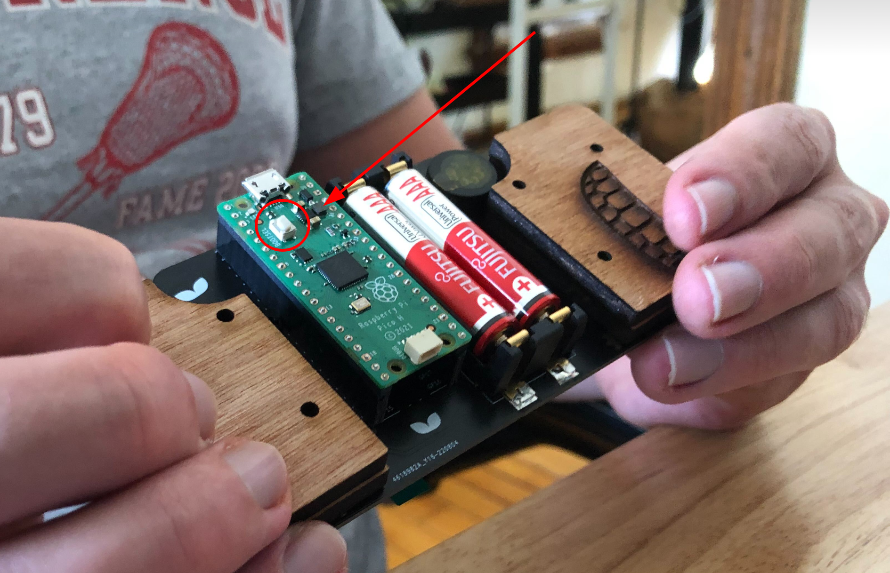
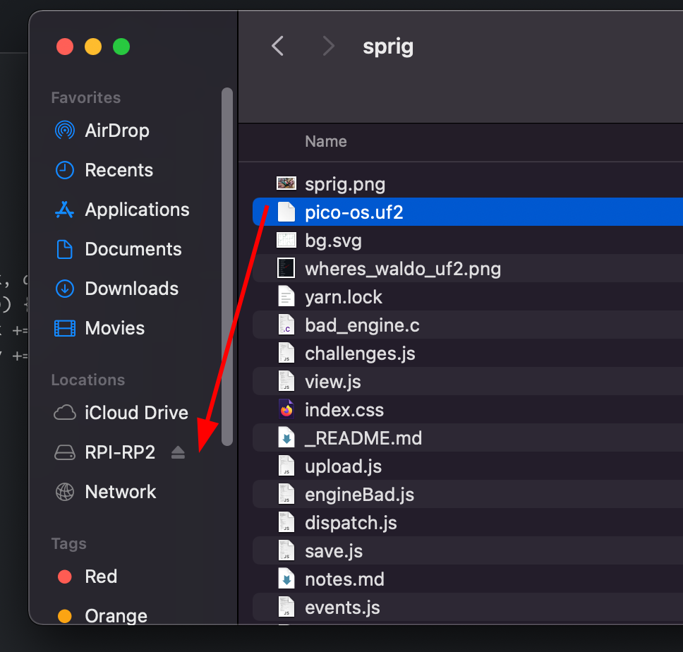
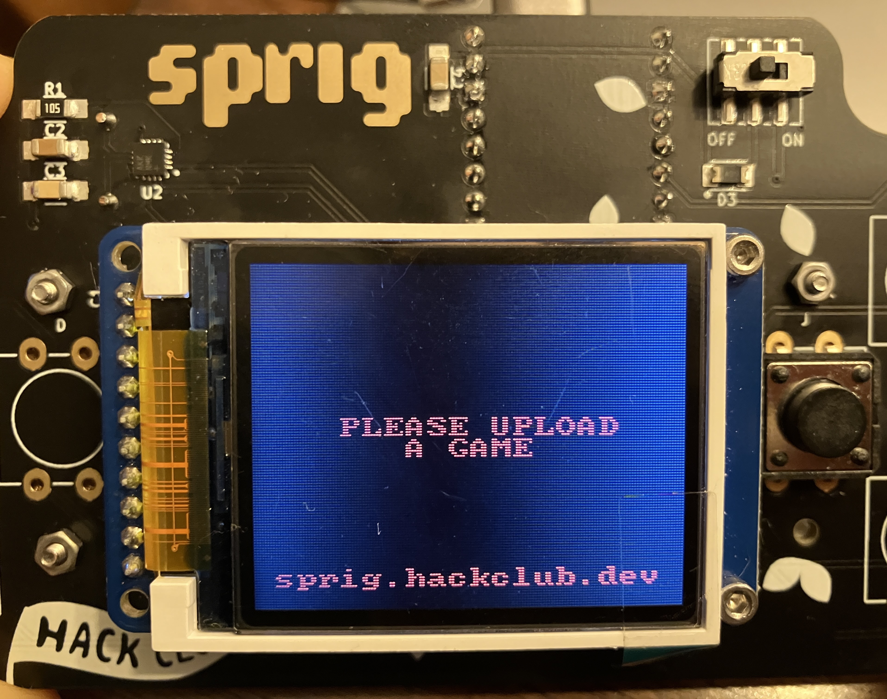

# Your Game, on Sprig ... in a Flash!

So you have it, resting on your desk in front of you, in all of its spriggy glory: the handheld Sprig console!

You created an incredible game to earn this thing, but uh ... you're not sure how to run that game on the device ...

Fortunately, there isn't too much that you have to do:

- Download a copy of the operating system we made for the device
- Hold down the "BOOTSEL" button on the back of the device, and plug it in
- Drag and drop the operating system onto the device ("flash" the OS onto it)

That's all!

## Have no fear, UF2 is here!

Click on [this link](https://sprig.hackclub.com/pico-os.uf2) to download Spade, the operating system for the Sprig console.

## BOOTSEL



Hold that button right there, and plug in the sprig!

## Drag n Drop

It should appear in your file menu as a separate drive, much like a USB.


Just drop the .uf2 in there, and you're good to go! The device should immediately restart, and a message should appear on the screen.

> **Note:** If you're having trouble getting the .uf2 file onto the Pico using the macOS Finder, try using the command line tool `cp` instead.
> For example, if you downloaded the .uf2 file to your Downloads folder, you could run the following command in your terminal to copy the file to the Pico.

```sh
cp -X ~/Downloads/pico-os.uf2 /Volumes/RPI-RP2
```



## Okay but how do I upload MY game?


Open up your game in the editor, click the "Run on Device" button in the top right, and select the Sprig from the menu (again, like a USB device.)

That's it! You're done :)

> [!NOTE]
> Make sure you're using a Chromium-based browser such as Edge or Chrome.
> If you're using Linux, check the Linux section below because you probably need more setup!


## But I use Linux!

Chances are, you need to do some additional setup to flash your game on Linux. But don't fear - it's straightforward!

### Join the group!

For most Linux distributions, you need to add your user to the `dialout` group. If this group doesn't exist, or it doesn't work, add your user to the `uucp` group instead.

If you're on Arch, or an Arch-based distro, you will likely need to use `uucp` as the `dialout` group doesn't exist.

To add a user to a group, run the following command replacing the groupname and user as appropriate:
```sh
sudo usermod -aG dialout orpheus
```
> [!NOTE]
> You will likely be prompted for your password. Don't worry if you can't see it - that's normal! Just type it out as normal and press enter

**Make sure to reboot your system after making this change** and you should be good to get flashing!

### Flatpaks - I play with sandboxes!

Is your browser installed as a Flatpak? This means that you need to do more setup because it's running in a sandbox so it likely won't have access to serial ports. To fix this, run the following override command replacing the flatpak name as appropriate:

```sh
flatpak override --device=all org.chromium.Chromium
```
> [!NOTE]
> Depending on your setup, you may need to run this command with sudo.

Now you should be good to flash your game to your Sprig! Oh, but make sure to restart your browser after making that change :)

Happy sprigging! :D
