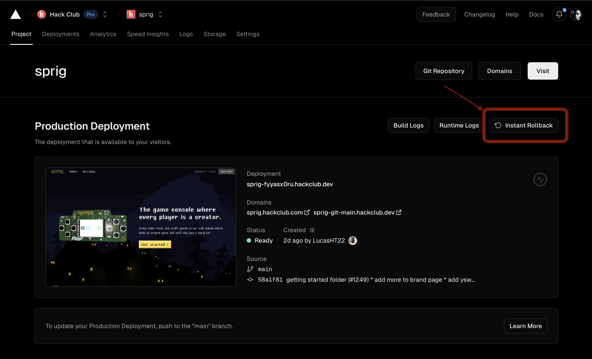
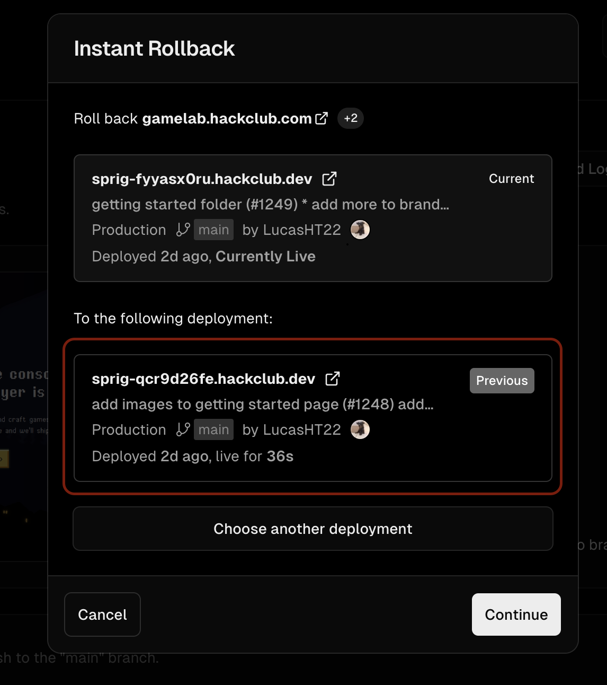

# Sprig Runbook 

## References
- Grafana Dashboard: [telemetry.hackclub.com](https://telemetry.hackclub.com) 
- Vercel Project: [hackclub/vercel](https://vercel.com/hackclub/sprig)
- Sprig Grafana Alerts [sprig @ grafana alerts](https://telemetry.hackclub.com/alerting/list)
- Sprig Grafana Dashboard [sprig @ grafana](https://telemetry.hackclub.com/d/b7ac7960-a18f-4c83-a4e5-767d50ad62c7/sprig?orgId=1)

## Rollback to the latest stable deployment

Go to [vercel hackclub/sprig](https://vercel.com/hackclub/sprig) project and click the instant rollback button.

Then select the previous deployment. 

## Database operations fail or take too long
- To see what database operations are failing, open the sprig dashboard in grafana [here](https://telemetry.hackclub.com/d/b7ac7960-a18f-4c83-a4e5-767d50ad62c7/sprig?orgId=1) and look under the 'Endpoint latencies over time' visualization or the 'Endpoint failures' visualizations. 
- Open the [Vercel Logs](https://vercel.com/hackclub/sprig/logs?page=1&timeline=past30Minutes&startDate=1702547588649&endDate=1702549388649) for Sprig and checkout logs with level 'Error' or 'Warning'. 

### Attempt to trigger a failing operation
- If the failing database operation is any of the following, open the live logs on vercel while doing one of the following.
	- `api_games_save`, reproduce by opening one of your games in the editor, make an edit
	- `api_games_delete`, reproduce by deleting one of the games in your accout from the dashboard
	- `api_games_rename`, reproduce by opening one of your games in the editor, edit the games's name 
	- `api_thumbnail`, reproduce by opening the [sprig gallery](https://sprig.hackclub.com/gallery) 
	- `api_auth_email-login-code` or `api_auth_submit-code`, reproduce by logging into your account

## Sprig stops reporting to grafana

- Go to [environment variables](https://vercel.com/hackclub/sprig/settings/environment-variables) and the check if the 'GRAPHITE_HOST' is correctly set to `telemetry.hackclub.com`

## An error you are unsure about

- Open the [Grafana Dashboard](https://telemetry.hackclub.com/d/b7ac7960-a18f-4c83-a4e5-767d50ad62c7/sprig?orgId=1) and look at the visualizations. 
- Open the [Vercel Logs](https://vercel.com/hackclub/sprig/logs?page=1&timeline=past30Minutes&startDate=1702547588649&endDate=1702549388649) and look at logs with log level 'Warning' or 'Error'
- Alternatively, open the developer console console on the sprig website and look at the client-side logs.
Problematic situations should most likely be apparent.  