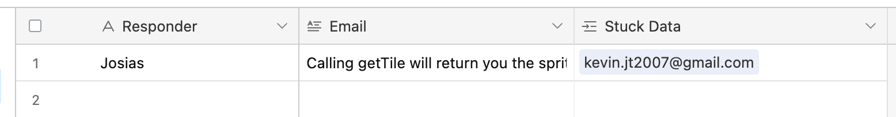

## Getting new Sprig Stuck Action Items
Run `/slacker list sprig stuck` to get all action items regarding sprig-stuck-requests.

## Following up with stuck-requests

### Email template

Hey,

This is a response to the stuck request you sent.

In the description you wrote: `Description`

After careful investigation, we have identified the following issues in your code:

1. `Issue` on line `Line`.
2. ...

Here is a fix for the issues stated above, respectively

1. `Explanation`
   `Fix`
2. ...

Thank you for your patience.

Kindly,
`Name`.

### Email template to use if there are no errors or description

Hey,

This is a response to your stuck request.

Thank you for reaching out for assistance. Unfortunately, it seems that your request didn't include specific details or actionable information that would allow us to address your issue effectively.

This information will enable us to offer a more accurate and timely solution to your request. Feel free to respond with the necessary details, and we'll do our best to assist you.

Thank you for your understanding.

Kindly,
`Name`

After sending the email, please create a new record in Airtable with the your name, the email you sent and a reference to the request you sent.



### Data Schema for Stuck Requests

Stuck Request

```ts
ErrorLog = {
	description: String,
	raw: {
		index: Number,
		lineNumber: Number,
		description: String
	},
	line: Number,
	column: Number
}
```

```ts
StuckRequest = {
	Code: String,
	Email: String
	Session Length: Float // time in seconds
	Error Log: JSONSerializable<List<ErrorLog>>,
	Description: String,
	Category: "Logic Error" | "Syntax Error" | "Other"
}
```

Structure of truth data

```ts
Responder: String, // name of person responding to the stuck request
Email: String // email text being sent
Stuck Data: StuckData // a reference to the stuck request being responded to
```
